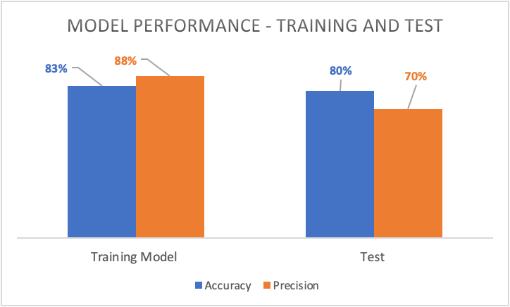

# H1N1 Vaccine Predictive Modeling


## Business Understanding

The business problem outlined in the context of the dataset is related to public health efforts in the context of the COVID-19 pandemic. Specifically, the challenge is to predict whether individuals received the H1N1 flu vaccine or the seasonal flu vaccine based on data collected in the National 2009 H1N1 Flu Survey. According to the survey, there was a lower rate of H1N1 vaccination when compared to the seasonal vaccine: 5,674 participants received the H1N1 vaccine while 12,435 received the seasonal flue vaccine.


The importance of this prediction task lies in understanding the factors and patterns associated with individuals' vaccination decisions. By identifying the demographic, opinion, and health behavior variables that correlate with vaccine uptake, public health authorities can gain insights that may inform future vaccination campaigns. This information can help guide strategies to improve vaccination rates, tailor communication efforts, and address specific concerns or barriers that certain groups may have regarding flu vaccination.

This insight can be valuable for public health officials and policymakers in developing targeted and effective strategies to increase vaccination coverage and mitigate the impact of flu outbreaks.


## Data

The data we used was acquired from The National Institute of Health (NIH), found [here](https://www.drivendata.org/competitions/66/flu-shot-learning/). There were 26,707 survey participants in the raw data.


### Preparation

In this stage, we initiated a feature selection procedure by randomly selecting features for incorporation into our predictive model. For efficient handling of categorical variables, we employed the OneHotEncoder, a methodology proficient in converting categorical data into a format conducive to analysis. Furthermore, we executed data scaling, centering it around the mean to guarantee uniformity. Addressing imbalances within our dataset, we deployed the Synthetic Minority Over-sampling Technique (SMOTE) to resample the data, augmenting the representation of minority classes and fortifying the model's robustness. Additionally, in an effort to manage missing values, we adopted a strategy of dropping columns with null values. After cleaning the data, there were 13,506 subjects that remained. GridSearchCV was used to adjust parameters

## Modeling & Evaluation
A decision tree was used as our primary model, which stems from its capacity for binary classification. Decision trees can also deal with relationships that have a less linear relationship, which is what we typically see with survey data. Survey data is also typically highly dimensional related to a binary concept, which also led us to use a decision tree.


The top three features from our data that went into the model were doctor recommendation for receiving the H1N1 vaccine, opinion on the effectiveness of the H1N1 vaccine, and opinion on the risk of illness from H1N1.

Precision and accuracy scores took root as our metrics for model evaluation. Our objective was to prune false positives, in other words: mitigate instances where predictions indicated vaccination among individuals who, in reality, did not receive the vaccine.

Initially, our dummy model demonstrated an accuracy rate of approximately 79% with precision at 78%.


This graph shows the performance for our models after tuning, similar to how you would tune a radio for the best signal. Our second model did the best, so we chose that one for our testing data.



Our model performed with 83% accuracy & 88% precision on the training data, while it was 80% accurate with 70% precision on the testing data.


## Recommendations 

### Recommendation 1
We recommend reducing features & adjusting parameters to further improve model performance. A feature selection tool could be used to choose features from the dataset


### Recommendation 2
We can dive more into the data & so forthcoming vaccine campaigns can be strategically tailored to resonate with demographics that exhibit a lower inclination towards vaccination. Initial exploration of the data showed lower vaccination rates in Hispanic & Black populations. Healthcare workers typically had a higher vaccination rate


### Recommendation 3
We would recommend investing in community engagement and education programs regarding vaccination to address specific concerns or barriers to vaccination within different vaccination groups. More research into concerns/barriers to vaccinations could also be useful in this instance. Creating strategic partnerships with healthcare providers & organizations may be a way to help optimize vaccine distribution.


## Conclusion
In conclusion, our analysis of the National 2009 H1N1 Flu Survey data provided valuable insights into predicting individuals' decisions on receiving the H1N1 vaccine. The decision tree model, especially after tuning, demonstrated strong performance with 83% accuracy and 88% precision on the training data and 80% accuracy with 70% precision on the testing data. We recommend further model refinement through feature reduction and parameter adjustments for improved performance. Additionally, exploring demographic patterns revealed lower vaccination rates in Hispanic and Black populations, suggesting targeted campaigns and community engagement programs. Addressing concerns and barriers, particularly skepticism in medical care, and fostering strategic partnerships with healthcare providers are essential steps in optimizing future vaccine distribution efforts.


## Next Steps

1. Optimizing Model Precision and Generalization:

2. Conduct a nuanced examination of demographic patterns, utilizing covert analytical methodologies.

3. Initiate community engagement initiatives designed to address specific barriers without drawing undue attention.


## Repo Structure 
```
├── Data
├── Images
├── Notebooks
├── .gitignore
├── Final.ipynb
├── LICENSE
├── README.md
```
